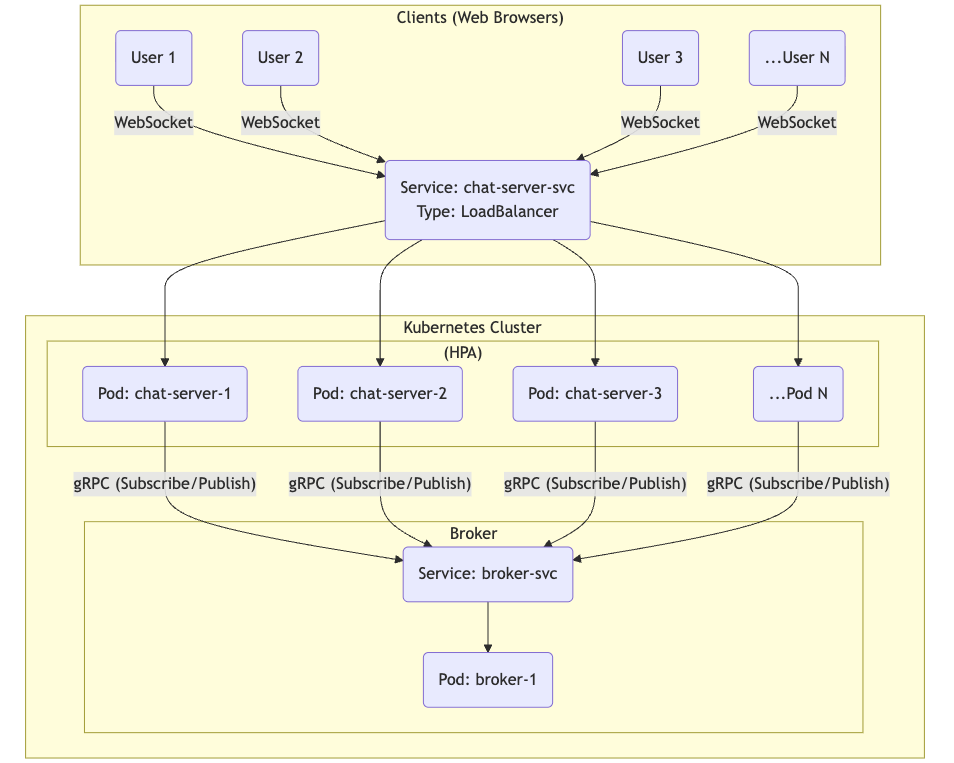
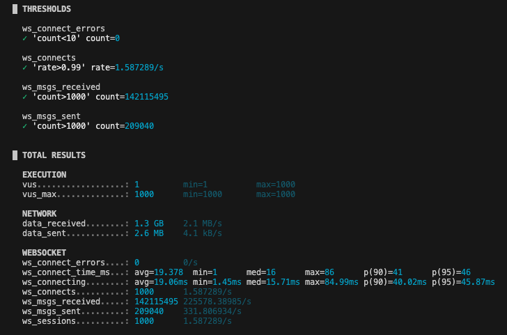

# LetsGoChat: A Scalable, Distributed Chat Service

This project is a high-performance, real-time chat application built from scratch in Go. It demonstrates a cloud-native, microservices architecture designed for high availability and horizontal scalability.

The system is engineered to handle thousands of concurrent WebSocket connections, with a custom-built gRPC pub/sub message broker decoupling the chat servers for seamless scaling. The entire application is containerized with Docker and ready for deployment on Kubernetes.



## Key Features

* **Performance:** K6 load test results(10mins) - Achieved p95 connection latency <50ms
     under peak load of 1000 concurrent users while sustaining input throughput of 330+ msgs/sec to fan-out 140M+ messages.


* **Horizontally Scalable:** The chat server is stateless, allowing new instances to be added or removed instantly to handle load.
* **Custom gRPC Broker:** A lightweight, high-performance pub/sub message broker, built in Go, manages message distribution between all server instances. Connected via gRPC in pub/sub architecture, with **Unary type for broadcasting message to broker and Server Side Streaming for receiving messages from broker**.
* **Real-Time Communication:** Uses WebSockets for persistent, low-latency client-server communication.
* **Cloud-Native:** Fully containerized with Docker and orchestrated with Kubernetes, including services, deployments, and a Horizontal Pod Autoscaler (HPA).

## How to Run This Project
This project is designed for both local testing (Docker Compose) and a full scalability test (Minikube/Kubernetes).

## 1. Local Functional Test
This test confirms that the chat, server, and broker all work together.

#### First, generate the gRPC code (only needed once)
#### You must have 'protoc' and 'protoc-gen-go-grpc' installed.
#### If not, skip this and let the Docker build handle it. 
```
protoc --go_out=. --go-grpc_out=. grpcproto/chat.proto 
```

#### Build and run the containers
```
docker-compose up -d --build
```

#### Open two browser tabs to http://localhost and start chatting.

## 2. Kubernetes Scalability Test
This is the main showcase. Load test the application and watch it autoscale.

#### 0. Start Minikube
```
minikube start --cpus=4 --memory=4096
```

#### 1. Point your terminal's Docker to Minikube
```
eval $(minikube -p minikube docker-env)
```

#### 2. Build the Docker images INSIDE Minikube
#### (This uses the multi-stage Dockerfiles)
```
docker build -t chat-server:latest ./chat-server
docker build -t broker:latest ./broker
```

#### 3. Deploy the app to Kubernetes
```
kubectl apply -f deployment.yaml
```

#### 4. Install & Enable Monitoring
```
minikube addons enable metrics-server
```

#### 5. Get the app URL
```
minikube service chat-server-svc
```
This will give url for the chat room, something like -> http://127.0.0.1:54585

#### 6. (New Terminal) Run the K6 Scalability Test 
```
k6 run -e WS_URL=ws://<your url>127.0.0.1:54585/ws k6-load-test.js
```

#### 7. (New Terminal) Watch the kubernetes pods scale with their CPU metrics
```
kubectl get pods -w
```

#### 8. Delete the deployment and stop Minikube
```
kubectl delete -f deployment.yml
minikube stop
```

#### 9. Dont forget to unlink Docker from Minikube
```
eval $(minikube docker-env -u)
```

